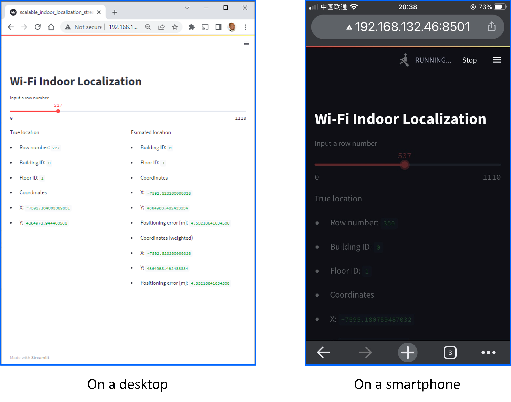

# indoor_localization_prototype
A prototype indoor localization system based on streamlit Web interface.


## Prerequisites
- [TensorFlow](https://www.tensorflow.org/)
- [streamlit](https://streamlit.io/)
- [pandas](https://pandas.pydata.org/)
## How to run
1. Build and save a DNN-based indoor localization model:
```
python scalable_indoor_localization.py
```
2. Run streamlit web interface:
```
streamlit run scalable_indoor_localization_streamlit.py
```